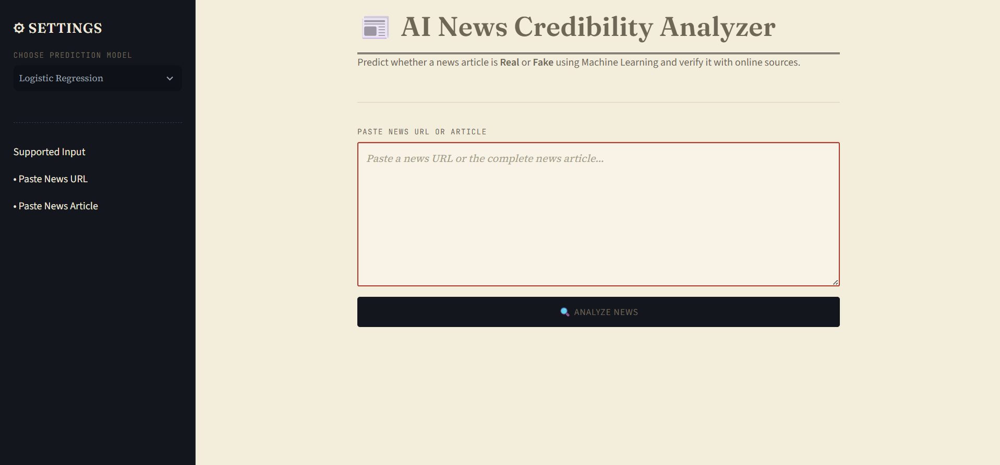
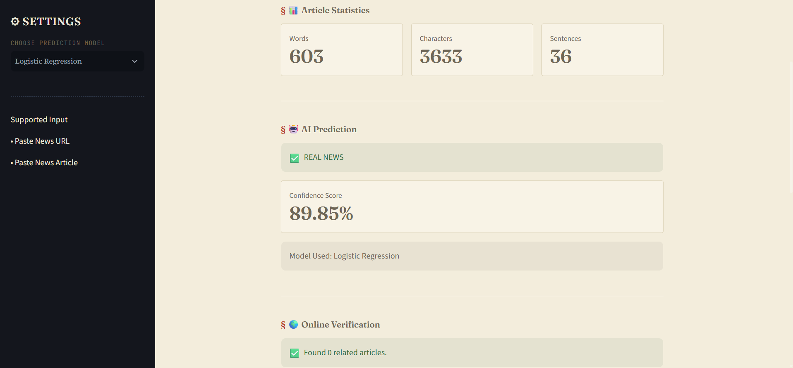
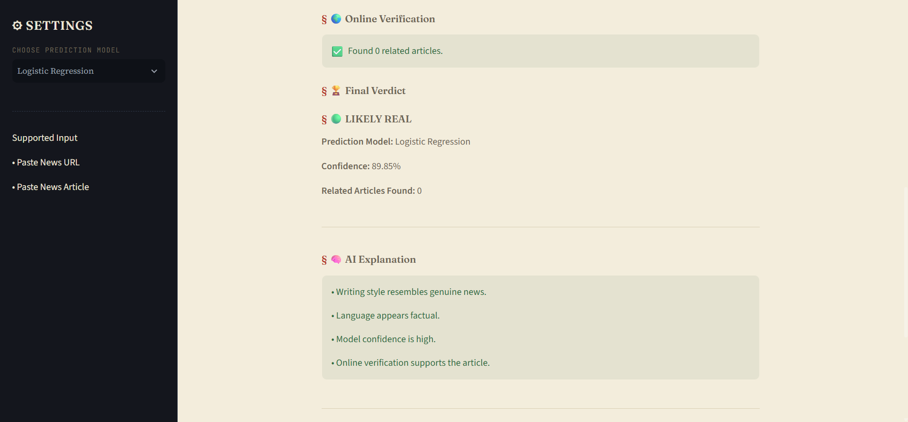
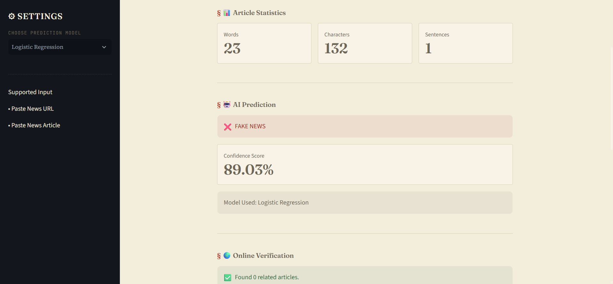
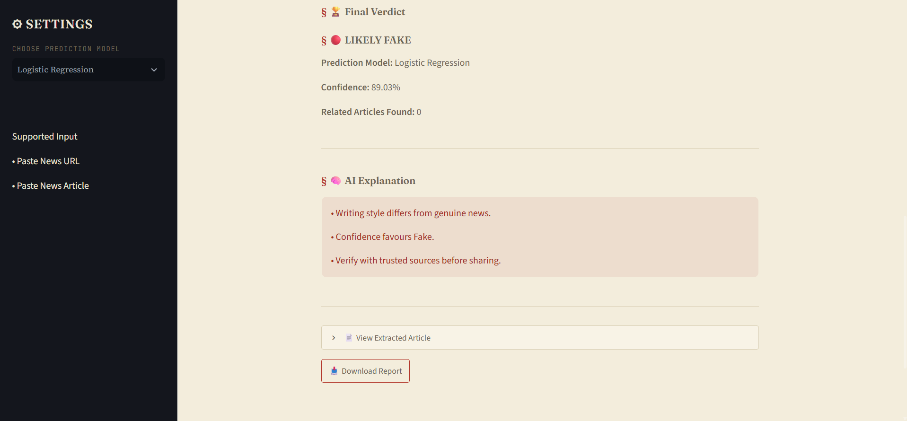

# 📰 AI News Credibility Analyzer

An AI-powered application that predicts whether a news article is **Real** or **Fake** using Machine Learning and verifies the article using trusted online news sources.

---

## Features

- Predicts Fake or Real News
- Supports News URL and News Text
- Extracts article automatically from URLs
- Article statistics (Words, Characters, Sentences)
- Confidence Score
- Online verification using GNews API
- Final credibility verdict
- AI-generated explanation
- Download prediction report
- Multiple prediction models

---

## Machine Learning Models

| Model | Accuracy |
|--------|----------|
| Logistic Regression | 89.25% |
| Random Forest | 62.12% |
| DistilBERT | 99.95% |

Users can switch between models directly from the sidebar.

---

## Tech Stack

- Python
- Streamlit
- Scikit-learn
- Transformers (DistilBERT)
- Newspaper3k
- BeautifulSoup
- GNews API
- Pandas
- NumPy

---

## Project Structure

```
AI-News-Credibility-Analyzer
│
├── streamlit_app/
│   ├── app.py
│   ├── style.css
│   └── assets/
│
├── src/
│
├── notebooks/
│
├── README.md
├── MODELS.md
├── DATASET.md
├── requirements.txt
└── LICENSE
```

---

# Application Screenshots

## Home Page



---

## Real News Prediction



---

## Final Verdict (Real News)



---

## Fake News Prediction



---

## Final Verdict (Fake News)



---

## Installation

Clone the repository

```bash
git clone https://github.com/HetikPatel26/AI-News-Credibility-Analyzer.git
```

Install dependencies

```bash
pip install -r requirements.txt
```

Run the application

```bash
streamlit run streamlit_app/app.py
```

---

## Models

The trained models are not included in this repository due to GitHub size limitations.

See **MODELS.md** for instructions.

---

## Dataset

The original datasets are excluded because of GitHub size limits.

See **DATASET.md** for download instructions.

---

## Future Improvements

- Support multiple news APIs
- Explainable AI (XAI)
- Multilingual support
- Browser extension
- Mobile application
- Live misinformation monitoring

---

## License

This project is released under the MIT License.

---

## Author

**Hetik Patel**

Diploma in Computer Engineering

AI News Credibility Analyzer – AI/ML Project